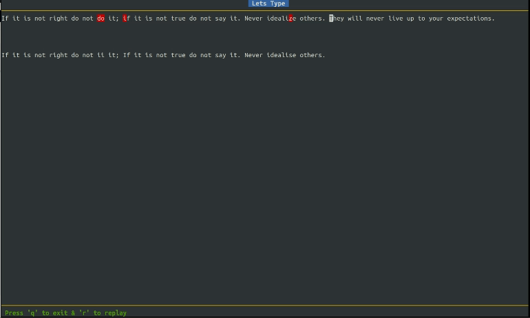

<div align='center'>

<hr>
✨ Performant, reliable & classy Typing Speed app. ✨
<hr>

</div>

---
## 🌎 Overview
Welcome to Let's Type, a sleek and efficient terminal-based typing speed calculator built with Python. Elevate your typing skills and track your progress with this interactive and user-friendly tool.

<!-- 
## Table on Contents
- 🫧 [ Features](#features)
- 🤨 [Why](#why)
- ⚙️ [Setup](#setup)
- 🤗 [Support](#support) -->

## 🫧 Features
- **Terminal Magic**: Let's Type brings typing speed evaluation right to your terminal, creating a seamless and distraction-free environment for users.

- **Python Power**: Developed entirely in Python, Let's Type is not just a typing speed calculator; it's a testament to the versatility and elegance of Python programming.

- **Interactive UI**: The user interface is designed with a focus on simplicity and engagement. Enjoy a visually appealing and intuitive design that enhances the overall typing experience.

- **Real-Time Metrics**: Get instant feedback on your typing speed, accuracy, and words per minute (WPM) as you type. Let's Type provides real-time metrics to help you gauge and improve your performance.

- **Progress Tracking**: Let's Type doesn't just measure your current speed—it helps you track your progress over time. Review your past performance and witness your improvement as you continue practicing.

## 🤨 Why
- Inspired by MonkeyType : )

## ⚙️ Setup
```bash
$ cd lets-type/
$ pip3 install -r requirements.txt
$ python3 lets-type/app.py
```
## 🤗 Support
- Make sure to leave a ⭐ if you like this project.
